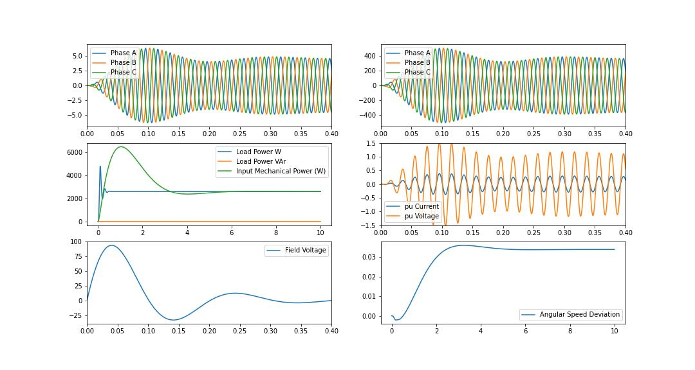

# Simulation-and-Modelling

<h2>Synchronous Machine With Load</h2>
<h3>Synchronous Machine Modelling Equations</h3>

<h4> Differential Equations</h4>
$$T_{d0}' \frac{dE_q'}{dt} = - E_q' - (X_d - X_d') I_d + E_{fd}$$
$$T_{q0}' \frac{dE_d'}{dt} = -E_d' - (X_q - X_q')I_q$$

$$\frac{d\delta}{dt} = \Delta ω$$

$$J\frac{d\Delta\omega}{dt} = P_m - P_{ei} - D \Delta \omega$$

$$P_{ei} = [ E_q'I_q + E_d'I_d - (X_d'-X_q')I_dI_q]$$

<h4> Algebraic Equations</h4>

$$V_d = E_d' - R_{sg}I_{d} - I_{q}X_q'$$
$$V_q = E_q' + I_{d}X_d' - I_{q}R_{sg}$$

<h3>Turbine/Governor Modelling Equations</h3>
$$T_{sv}\frac{dP_{sv}}{dt} = -P_{sv} + P{ref} - \frac{1}{R_d}\Delta \omega$$
$$T_{ch} \frac{dT_m}{dt} = - T_m + P_{sv}$$
<h3>Excitation Modelling Equation</h3>
$$T_A \frac{dE_{fd}}{dt} = - E_{fd} + K_A(V_{ref} - V_t)$$

<h3>Transmission Line Equation</h3>
$$L_1\frac{dI_d}{dt} = ω_sL_1I_q - R_1I_{d} + V_d - V_{dL}$$

$$L_1\frac{dI_d}{dt} = -ω_sL_1I_d - R_1I_{q} + V_q - V_{dL}$$

$L_1 = L_s - L_m$,
$R_1 = R_s - R_m$
<h3>Load Modelling Equations</h3>

$$I_{dL} = I_{d}$$
$$I_{qL} = I_{q}$$

$$I_{load} = I_{dL} + jI_{qL}$$
$$Z_{load} = R_{load} + jX_{load}$$
$$V_{load} = I_{load}Z_{load}$$
$$V_{load} = V_{dL} + jV_{qL}$$
$$S_{load} = I_{load}^* V_{load}$$

<h3>The result is shown below </h3>

